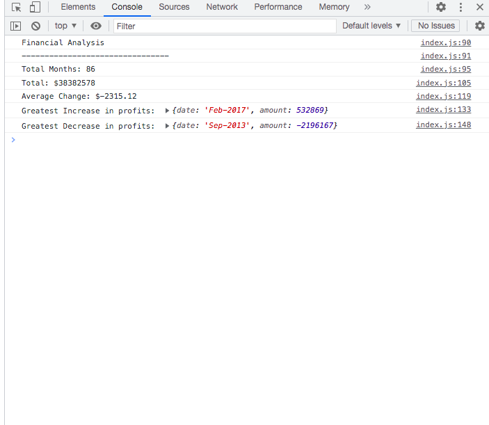

# console-finances

## Description

This weeks challenge was to use the starter file to create a financial analysis. This was to use all the current javascript knowledge I know to perform different calculations from an array. i have learnt how to calculate the lengths of an array, to sum up an array, to perform iterations, to use functions and to round a number.

## Usage

To see how the page performs, click on the console to see the financial analysis.

Here is the link to the github repository: https://github.com/shazzy-kawa/console-finances.git
Here is the link to the deployed page: https://shazzy-kawa.github.io/console-finances/

## Credits

I have completed this challenge using the sources provided by the bootcamp as well as the following links:

1) https://www.stechies.com/javascript-round-two-decimal-places/
2) https://www.w3schools.com/js/js_functions.asp 

